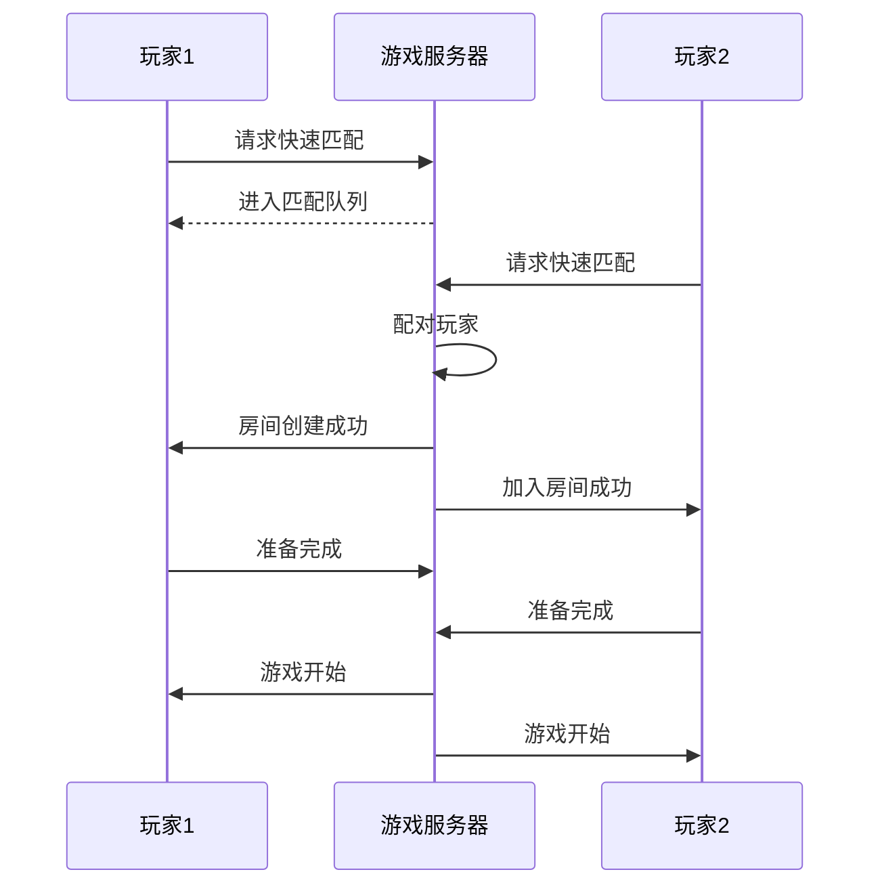
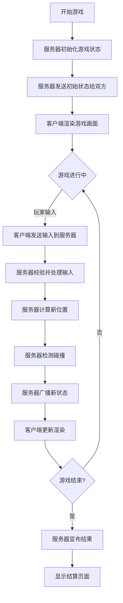

# 双人联机贪吃蛇对战游戏 - 产品需求文档

## 1. 产品概述

一款支持双人实时联机对战的经典贪吃蛇游戏，玩家通过网络连接进行激烈对抗。游戏融合了复古霓虹美学与现代交互体验，两条炫彩蛇在像素网格中追逐较量，先撞墙、自咬或被对手撞上的玩家将输掉比赛。

**核心价值**：简单易上手的竞技体验，5分钟内即可开一局，适合朋友聚会、休闲对战。

**目标用户**：休闲游戏玩家、朋友对战场景、竞技游戏爱好者

## 2. 核心功能

### 2.1 游戏模式

| 模式 | 描述 |
|------|------|
| **快速匹配** | 随机配对在线对手，秒级匹配 |
| **私人房间** | 创建房间邀请好友，支持密码保护 |
| **观战模式** | 旁观正在进行的对战 |

### 2.2 核心玩法

- **地图尺寸**：20x20 网格战场
- **初始长度**：每条蛇3节
- **食物规则**：每张地图同时存在2个食物，吃到后蛇身+1节
- **移动规则**：
  - 玩家1：WASD 或 方向键
  - 玩家2：方向键或自定义键位
  - 蛇只能朝当前方向或90度转向
  - 速度恒定，无加速机制
- **胜负判定**：
  - 撞墙 → 立即死亡
  - 撞到自己身体 → 立即死亡
  - 两蛇相撞 → 短蛇获胜，长度相同则先撞者输
  - 一蛇吃到毒食（概率刷新）→ 长度-2

### 2.3 房间系统

- **创建房间**：生成6位房间码，支持设置密码
- **加入房间**：输入房间码加入对战
- **房间状态**：等待中、游戏中、已结束
- **最多支持**：2名玩家实时对战

### 2.4 积分系统

- **胜利**：+10分
- **失败**：+0分
- **连胜加成**：连续获胜额外+2分/场
- **历史战绩**：显示总场次、胜率、最高连胜

## 3. 用户界面设计

### 3.1 视觉风格：赛博朋克霓虹

**色彩系统**：
- 主色调：`#0a0a0f` (深邃黑)
- 玩家1蛇：`#00ffaa` (青绿霓虹) + 发光效果
- 玩家2蛇：`#ff3366` (粉红霓虹) + 发光效果
- 食物：`#ffff00` (金黄) + 脉冲动画
- 背景：`#0f0f1a` (暗紫黑) + 网格线 `#1a1a2e`
- 强调色：`#00d4ff` (电光蓝)
- 文字：`#e0e0e0` (柔白)

**字体**：
- 标题：Orbitron (科技感几何字体)
- 正文：Rajdhani (现代清晰无衬线)

**动效**：
- 蛇移动：平滑插值过渡，无跳跃感
- 吃食物：粒子爆炸效果 + 蛇身闪烁
- 死亡：蛇身消散动画 + 屏幕震动
- 胜利：炫光扫过效果

### 3.2 页面结构

#### 主菜单页
- 游戏Logo (动态霓虹效果)
- 快速匹配按钮 (脉冲动画)
- 创建房间按钮
- 加入房间按钮
- 玩家信息展示 (昵称、积分)

#### 房间页
- 房间码显示 (大字醒目)
- 玩家1/2 状态卡片
- 等待提示动画
- 开始游戏按钮 (房主可见)
- 返回主菜单按钮

#### 游戏页
- 顶部信息栏：双方分数、生命状态
- 中央游戏画布 (响应式适配)
- 底部控制提示
- 暂停按钮
- 退出按钮

#### 结果页
- 胜利/失败大字
- 本局数据统计
- 再来一局按钮
- 返回主页按钮

### 3.3 响应式设计

- **桌面优先**：键盘控制体验最佳
- **移动端适配**：显示虚拟方向键
- **最小支持宽度**：320px

## 4. 技术架构

### 4.1 前后端架构

```
┌─────────────┐     WebSocket      ┌─────────────┐
│   Client A  │◄──────────────────►│   Server    │
│  (玩家1)    │                    │  (Node.js)  │
└─────────────┘                    └─────────────┘
       ▲                                 ▲
       │         WebSocket                │
       └─────────────────────────────────┘
                   ▲
                   │ WebSocket
                   ▼
            ┌─────────────┐
            │   Client B  │
            │  (玩家2)    │
            └─────────────┘
```

### 4.2 技术栈

- **前端**：原生 HTML5 + CSS3 + JavaScript (无框架依赖)
- **后端**：Node.js + ws (WebSocket库)
- **通信协议**：WebSocket 实时双向通信
- **状态管理**：内存存储 (房间状态、游戏状态)

### 4.3 游戏同步机制

- **帧率**：服务器每 150ms 发送一次游戏状态
- **输入延迟容忍**：客户端预测 + 服务器校验
- **断线重连**：60秒内可重连继续游戏

### 4.4 数据模型

#### 房间状态
```
Room {
  roomId: string (6位)
  password: string | null
  players: Player[]
  state: 'waiting' | 'playing' | 'finished'
  gameState: GameState | null
}
```

#### 游戏状态
```
GameState {
  snakes: Snake[]
  foods: Position[]
  gameLoop: number
  winner: string | null
}
```

#### 蛇
```
Snake {
  id: string
  body: Position[]  // [{x, y}, ...]
  direction: 'up' | 'down' | 'left' | 'right'
  alive: boolean
  color: string
}
```

## 5. 核心流程

### 5.1 匹配流程 (Mermaid时序图)



### 5.2 游戏进行流程



## 6. 验收标准

### 6.1 功能验收

- [ ] 两名玩家可成功建立WebSocket连接
- [ ] 房间创建和加入功能正常
- [ ] 蛇的移动、转向逻辑正确
- [ ] 食物生成和吃的判定正确
- [ ] 碰撞检测（墙、自己、对手）正确
- [ ] 游戏结束判定正确
- [ ] 结果页面正确显示

### 6.2 视觉验收

- [ ] 霓虹发光效果正常显示
- [ ] 蛇的移动平滑无卡顿
- [ ] 吃食物、死亡动画正常播放
- [ ] 响应式布局适配良好
- [ ] 键盘输入响应及时

### 6.3 性能验收

- [ ] 游戏延迟 < 200ms
- [ ] 60FPS 渲染流畅度
- [ ] 内存占用 < 100MB
- [ ] 页面加载时间 < 3秒

## 7. 未来扩展方向

- 排位赛系统
- 观战系统
- 皮肤系统
- 道具系统（炸弹、加速等）
- 地图编辑器
- AI对战模式
