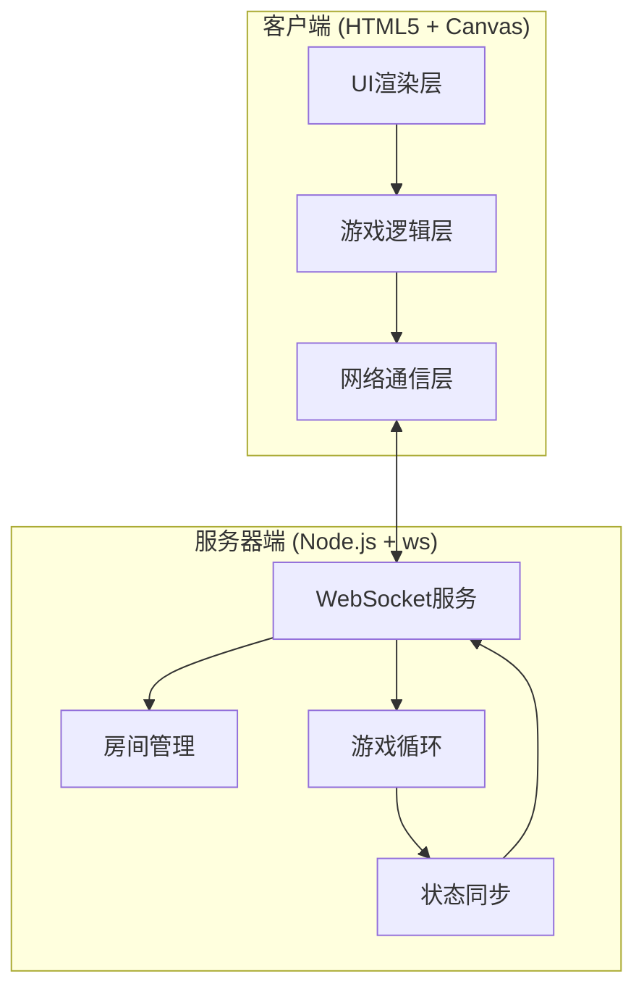

# 双人联机贪吃蛇对战游戏 - 技术架构文档

## 1. 系统架构

### 1.1 整体架构图



### 1.2 技术选型

| 层级 | 技术 | 说明 |
|------|------|------|
| **前端渲染** | HTML5 Canvas | 高性能2D游戏渲染 |
| **前端样式** | CSS3 + CSS变量 | 霓虹视觉效果 |
| **前端逻辑** | 原生JavaScript ES6+ | 无框架依赖，轻量化 |
| **后端运行** | Node.js | 事件驱动，适合实时应用 |
| **后端WebSocket** | ws | 高性能WebSocket库 |
| **进程管理** | nodemon | 开发环境自动重启 |

## 2. 目录结构

```
/workspace/
├── index.html          # 主入口页面
├── style.css          # 样式文件
├── js/
│   ├── main.js        # 主程序入口
│   ├── game.js        # 游戏核心逻辑
│   ├── renderer.js    # Canvas渲染器
│   ├── network.js     # WebSocket通信
│   └── ui.js          # UI控制器
├── server/
│   ├── index.js       # 服务器入口
│   ├── room.js        # 房间管理
│   ├── gameLogic.js   # 游戏逻辑
│   └── protocol.js    # 通信协议
├── package.json       # 依赖配置
└── .trae/
    └── documents/     # 文档目录
```

## 3. 通信协议

### 3.1 WebSocket消息格式

所有消息使用JSON格式：

```javascript
{
  "type": "message_type",
  "payload": { /* 消息内容 */ },
  "timestamp": 1234567890
}
```

### 3.2 消息类型定义

#### 客户端 → 服务器

| 消息类型 | payload | 说明 |
|---------|---------|------|
| `join_room` | `{roomId, password?}` | 加入房间 |
| `create_room` | `{password?}` | 创建房间 |
| `player_input` | `{direction}` | 玩家输入 |
| `ready` | `{}` | 玩家准备 |
| `leave_room` | `{}` | 离开房间 |

#### 服务器 → 客户端

| 消息类型 | payload | 说明 |
|---------|---------|------|
| `room_created` | `{roomId}` | 房间创建成功 |
| `room_joined` | `{roomId, players}` | 加入房间成功 |
| `player_joined` | `{playerId}` | 其他玩家加入 |
| `player_left` | `{playerId}` | 其他玩家离开 |
| `game_start` | `{initialState}` | 游戏开始 |
| `game_state` | `{snakes, foods, scores}` | 游戏状态同步 |
| `game_over` | `{winner, reason}` | 游戏结束 |
| `error` | `{code, message}` | 错误信息 |

### 3.3 状态同步频率

- **游戏循环**：服务器每 150ms 执行一次游戏更新
- **状态广播**：每次游戏更新后广播给所有房间内玩家
- **输入处理**：服务器实时接收并缓存玩家输入

## 4. 核心模块设计

### 4.1 游戏逻辑模块 (gameLogic.js)

```javascript
class GameLogic {
  // 初始化游戏
  initGame(snakes, foods) {}

  // 处理玩家输入
  handleInput(playerId, direction) {}

  // 更新游戏状态
  update() {
    this.moveSnakes()
    this.checkCollisions()
    this.checkFoodCollision()
  }

  // 蛇移动
  moveSnakes() {}

  // 碰撞检测
  checkCollisions() {
    this.checkWallCollision()
    this.checkSelfCollision()
    this.checkSnakeCollision()
  }

  // 获取游戏状态
  getState() {}
}
```

### 4.2 房间管理模块 (room.js)

```javascript
class RoomManager {
  rooms: Map<string, Room>

  createRoom(playerId, password?) {}
  joinRoom(roomId, playerId, password?) {}
  leaveRoom(roomId, playerId) {}
  getRoom(roomId) {}
  isRoomFull(roomId) {}
}
```

### 4.3 渲染模块 (renderer.js)

```javascript
class GameRenderer {
  constructor(canvas) {}

  // 渲染游戏画面
  render(gameState) {
    this.drawBackground()
    this.drawGrid()
    this.drawFoods()
    this.drawSnakes()
    this.drawEffects()
  }

  // 绘制网格
  drawGrid() {}

  // 绘制食物（带动画）
  drawFoods() {}

  // 绘制蛇（带发光效果）
  drawSnakes() {}

  // 绘制特效
  drawEffects() {}
}
```

## 5. 数据结构

### 5.1 房间状态

```typescript
interface Room {
  id: string;           // 6位房间码
  password: string | null;
  players: Player[];    // 最多2人
  state: 'waiting' | 'playing' | 'finished';
  gameLogic: GameLogic | null;
  createdAt: number;
}
```

### 5.2 玩家

```typescript
interface Player {
  id: string;
  ws: WebSocket;
  nickname: string;
  ready: boolean;
  score: number;
  color: string;
}
```

### 5.3 游戏状态

```typescript
interface GameState {
  snakes: Snake[];
  foods: Food[];
  scores: {[playerId: string]: number};
  winner: string | null;
  loopCount: number;
}

interface Snake {
  id: string;
  body: Position[];     // 身体节点数组
  direction: Direction;
  nextDirection: Direction;
  alive: boolean;
  color: string;
}

interface Food {
  id: string;
  position: Position;
  type: 'normal' | 'poison';
}

interface Position {
  x: number;
  y: number;
}

type Direction = 'up' | 'down' | 'left' | 'right';
```

## 6. 游戏规则实现

### 6.1 地图配置

```javascript
const GAME_CONFIG = {
  GRID_WIDTH: 20,
  GRID_HEIGHT: 20,
  CELL_SIZE: 25,
  TICK_RATE: 150,        // ms per game tick
  INITIAL_LENGTH: 3,
  MAX_FOOD: 2,
  POISON_CHANCE: 0.1,    // 毒食生成概率
};
```

### 6.2 碰撞检测算法

```javascript
// 墙碰撞
function checkWallCollision(snake) {
  const head = snake.body[0];
  return head.x < 0 || head.x >= GRID_WIDTH ||
         head.y < 0 || head.y >= GRID_HEIGHT;
}

// 自碰撞
function checkSelfCollision(snake) {
  const head = snake.body[0];
  return snake.body.slice(1).some(
    segment => segment.x === head.x && segment.y === head.y
  );
}

// 蛇间碰撞
function checkSnakeCollision(snake1, snake2) {
  const head1 = snake1.body[0];
  const head2 = snake2.body[0];
  // 头碰头
  if (head1.x === head2.x && head1.y === head2.y) {
    return snake1.body.length > snake2.body.length ? snake2 : snake1;
  }
  // 头碰身
  for (const segment of snake2.body) {
    if (head1.x === segment.x && head1.y === segment.y) {
      return snake1;
    }
  }
  return null;
}
```

### 6.3 食物生成

```javascript
function generateFood(existingFoods, snakes) {
  const occupied = new Set();
  snakes.forEach(snake => {
    snake.body.forEach(seg => occupied.add(`${seg.x},${seg.y}`));
  });
  existingFoods.forEach(food => occupied.add(`${food.x},${food.y}`));

  const available = [];
  for (let x = 0; x < GRID_WIDTH; x++) {
    for (let y = 0; y < GRID_HEIGHT; y++) {
      if (!occupied.has(`${x},${y}`)) {
        available.push({x, y});
      }
    }
  }

  if (available.length > 0) {
    const pos = available[Math.floor(Math.random() * available.length)];
    return {
      id: generateId(),
      position: pos,
      type: Math.random() < POISON_CHANCE ? 'poison' : 'normal'
    };
  }
  return null;
}
```

## 7. 网络同步策略

### 7.1 客户端预测

```javascript
class ClientPrediction {
  constructor() {
    this.pendingInputs = [];
  }

  sendInput(direction) {
    const input = {
      direction,
      sequence: ++this.sequenceNumber
    };
    this.pendingInputs.push(input);
    this.ws.send(JSON.stringify({
      type: 'player_input',
      payload: input
    }));
    this.applyInputLocally(direction);
  }

  onServerState(state) {
    // 移除已确认的输入
    this.pendingInputs = this.pendingInputs.filter(
      input => input.sequence > state.lastProcessedSequence
    );
    // 校正到服务器状态
    this.currentState = state;
    // 重放待确认的输入
    this.pendingInputs.forEach(input => {
      this.applyInputLocally(input.direction);
    });
  }
}
```

### 7.2 延迟补偿

```javascript
// 服务器端：延迟历史记录
const DELAY_BUFFER_SIZE = 10;

class ServerGameLoop {
  constructor() {
    this.stateHistory = new CircularBuffer(DELAY_BUFFER_SIZE);
  }

  processInput(playerId, input, clientTimestamp) {
    const serverTime = Date.now();
    const delay = serverTime - clientTimestamp;
    const targetState = this.stateHistory.getAt(delay / TICK_RATE);
    // 基于历史状态处理输入
  }
}
```

## 8. 部署架构

### 8.1 开发环境

```bash
# 终端1: 启动后端服务器
cd server
node index.js

# 终端2: 静态文件服务
npx serve . -l 3000
```

### 8.2 生产环境

- **前端**：Nginx 静态文件服务
- **后端**：PM2 进程管理
- **WebSocket**：Nginx 反向代理 (可选)

### 8.3 环境变量

```bash
PORT=8080              # 服务器端口
GRID_WIDTH=20          # 地图宽度
GRID_HEIGHT=20         # 地图高度
TICK_RATE=150          # 游戏帧率(ms)
```

## 9. 性能优化

### 9.1 客户端优化

- Canvas 双缓冲渲染
- 对象池复用 (食物、粒子)
- 离屏 Canvas 预渲染静态元素
- requestAnimationFrame 节流

### 9.2 服务器优化

- 房间数据使用 Map 存储，O(1) 查找
- 状态更新批量处理
- 减少 WebSocket 消息体积 (压缩字段名)

## 10. 安全性考虑

### 10.1 输入校验

- 服务器验证所有玩家输入
- 限制转向频率 (防止180度反向)
- 校验移动方向的合法性

### 10.2 房间安全

- 房间码使用加密随机生成
- 密码加盐哈希存储
- 限制房间存活时间 (30分钟)

### 10.3 反作弊

- 服务器作为唯一真相源
- 定期广播校验和
- 异常行为检测 (超高速移动等)

## 11. 错误处理

### 11.1 断线重连

```javascript
// 服务器检测断线
ws.on('close', () => {
  const player = findPlayerByWs(ws);
  if (player && currentGame) {
    // 通知对手
    broadcastToRoom(player.roomId, {
      type: 'opponent_disconnected'
    });
    // 保留房间60秒
    setTimeout(() => {
      if (!player.reconnected) {
        closeRoom(player.roomId);
      }
    }, 60000);
  }
});
```

### 11.2 错误消息

| 错误码 | 描述 | 处理 |
|--------|------|------|
| `ROOM_NOT_FOUND` | 房间不存在 | 提示玩家房间码错误 |
| `ROOM_FULL` | 房间已满 | 提示玩家房间已满 |
| `WRONG_PASSWORD` | 密码错误 | 提示重新输入 |
| `INVALID_INPUT` | 无效输入 | 忽略并继续 |
| `GAME_NOT_STARTED` | 游戏未开始 | 提示等待 |
